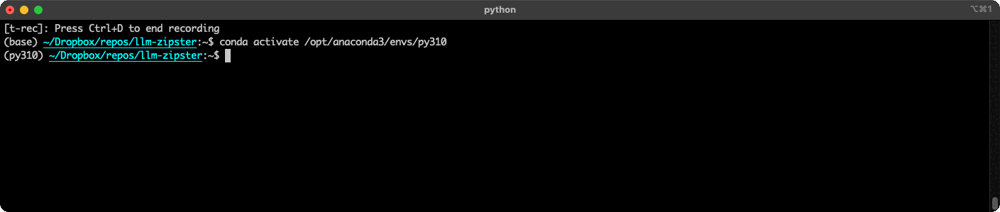

# LLMZipster

LLMZipster is a compressor and decompressor utility that uses arithmetic coding with LLM next token probabilities to compress and decompress text. 



## Usage

### Command Line

#### Compress a file:
```bash
python llm_zipster.py --compress --input input.txt --output compressed.b64
```

#### Compress a string:
```bash
python llm_zipster.py --compress --text "The cat sat on the mat and purred." --output compressed.b64
```

#### Decompress and print to stdout:
```bash
python llm_zipster.py --decompress --input compressed.b64
```

### Python

```python
from llm_zipster import LLMZipster

text = ("NYC is a melting pot of cultures, with diverse neighborhoods like Chinatown, Little Italy, and Harlem "
        "each offering unique flavors, traditions, and artistic expressions. The city's theater district, "
        "Broadway, is a mecca for performing arts, drawing millions with its world-class productions. Museums "
        "like the Metropolitan Museum of Art and the Museum of Modern Art house invaluable collections spanning "
        "centuries and continents.")
data = text.encode("utf-8")
zipster = LLMZipster(verbose=True, num_bits=512)
compressed = zipster.compress(data)
decompressed = zipster.decompress(compressed)
```

## References

- [Language Modeling Is Compression (arXiv:2309.10668)](https://arxiv.org/abs/2309.10668)
- [llama-zip: LLM-powered lossless compression tool (GitHub)](https://github.com/AlexBuz/llama-zip)